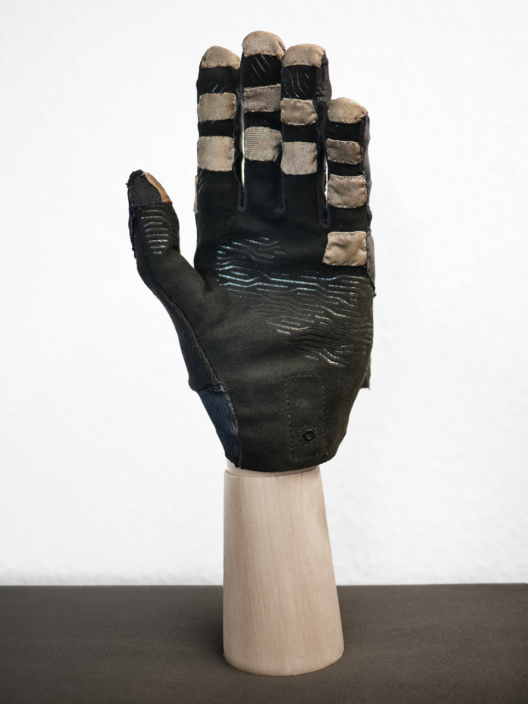
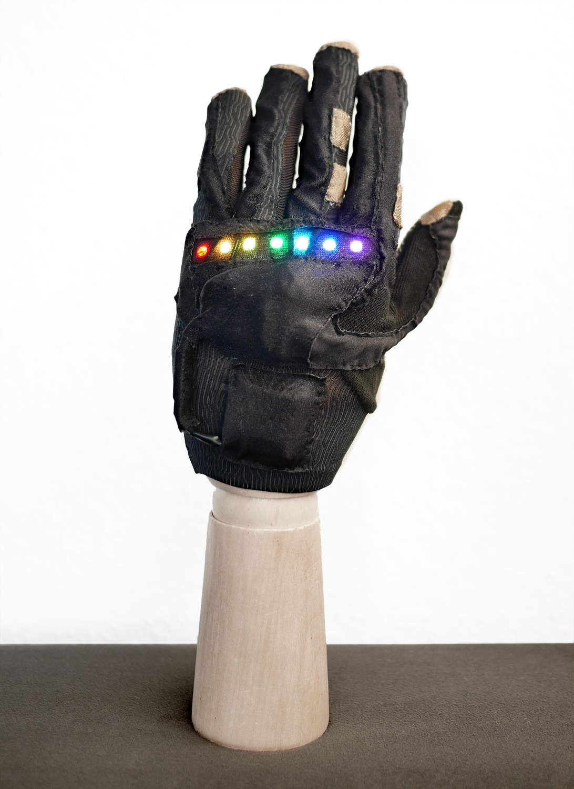
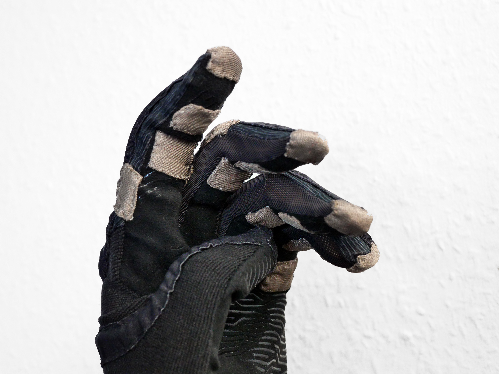
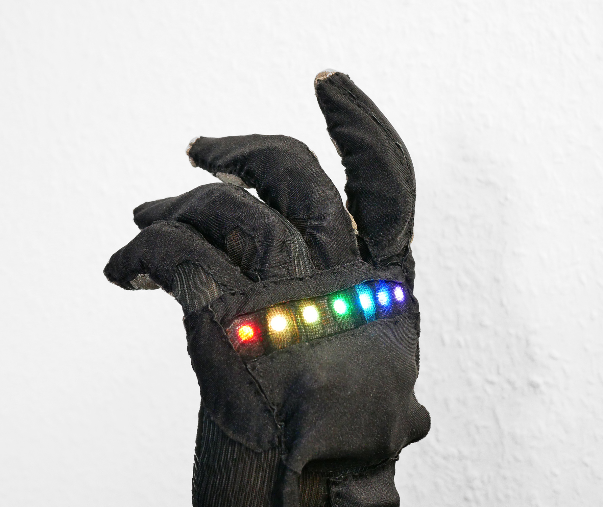

# Sneaky Gestures V2: Glove MIDI Controller




A wearable BLE-MIDI gestural instrument. The thumb acts as a common electrode
that touches conductive pads on the other fingers to play notes; a flex sensor
in the index finger bends pitch, a thumb FSR sends aftertouch, and the
accelerometer streams two continuous MIDI CCs. A 7-LED RGBW strip on the back
of the hand displays the current mode at a glance.

Built on a **Seeed XIAO nRF52840 Sense**. Transmits as a standard BLE-MIDI
device — pair it with any DAW, hardware synth, or mobile MIDI host.




---

## Features

- **12 finger pads** (3 per finger × 4 fingers) playing scale-quantized MIDI
- **20 scales** including major, minor, modes, pentatonic, blues, exotic
  modes — selectable live
- **Flex-bend** continuous pitch sweep mapped across the configured note range,
  scale-quantized
- **Two-axis accelerometer CCs** — CC74 / CC1 by default, swappable
- **Channel aftertouch** from the thumb FSR
- **Tap tempo** with sub-menus for key/root transpose, BPM nudge, CC swap, and
  the flex-range editor — works alongside incoming MIDI clock
- **Tempo-tracking pitch bend** — automatically retunes to the host's clock
  so samples stay in pitch when the project tempo changes
- **63 presets** persisted to onboard flash; MIDI Program Change recalls them
- **Save / load confirmation flash** — a 300 ms LED bar confirms each preset
  write (orange→cyan) and recall (green→cyan)
- **Serial patch backup/restore** — dump every preset to the USB serial console
  and paste them back, each line CRC-checked before it's written to flash
- **Per-channel and global stuck-note prevention** for reliable BLE-MIDI
- **Quantization grids** for both finger notes and flex notes (off / 1/8 /
  1/16 / 1/32), locked to internal tempo or external MIDI clock

## Hardware

| Component       | Where                            | Connection                        |
|-----------------|----------------------------------|-----------------------------------|
| MCU             | Wrist                            | Seeed XIAO nRF52840 Sense         |
| LED strip       | Back of hand                     | 7 × SK681 RGBW on pin 5           |
| Multiplexer     | Inline                           | CD74HC4067, S0–S3 on pins 9/8/7/6 |
| Touch pads      | 12 on the fingers + thumb common | Mux inputs                        |
| Flex sensor     | Index finger back                | Analog A2                         |
| FSR             | Thumb pad                        | Analog A1                         |
| IMU             | Onboard                          | LSM6DS3 (Sense board), I²C 0x6A   |
| Battery         | LiPo, JST connector              | `PIN_VBAT` monitor                |
| Boost Converter | Underneath the SK6812            | 5V regulator for the SK6812       |
| Silver Fabric   | 16 finger contact pads           | 16 channel pins of CD74HC4067     |

Bill of Materials and schematics: [README.md](hardware/README.md)
 
## LED display

The strip is the only on-device feedback. Each mode repaints it with a distinct
meaning — notes ripple outward from the played knuckle, the flex bar fills as
the finger bends, octave/spread/scale flash brief indicators, and the tap-tempo
and preset-browser modes each host several sub-views with their own LED layouts.

The full visual reference is in [LED_Mode_Reference.html](https://htmlpreview.github.io/?https://github.com/sneak-thief/Sneaky-Gestures-V2/blob/main/documentation/LED_Mode_Reference.html)

## Build

This is a [PlatformIO](https://platformio.org/) project targeting the Adafruit
nRF52 BSP which is also used by the Seeed XIAO Sense. 

[Install Seeed XIAO Sense toolchain](https://wiki.seeedstudio.com/xiao_nrf52840_with_platform_io/)

```sh

#Install Adafruit nrfutil to be able to automatically upload the firmware
pip3 install --user adafruit-nrfutil

# Build
platformio.exe run

# Upload 
platformio.exe run --target upload

# Clean
pio run -t clean
```

### Dependencies

All declared in `platformio.ini`:

- Adafruit_NeoPixel
- Adafruit Bluefruit nRF52 BSP
- FortySevenEffects/MIDI Library
- Seeed Arduino LSM6DS3
- Adafruit LittleFS
- Lightweight-CD74HC4067-Arduino

## Usage

1. Power on. The strip flashes the battery level briefly, then connects via
   BLE as `Glove`.
2. Pair from your host. The glove appears as a MIDI input.
3. Play by touching the thumb to a finger pad. The lit knuckle and the colour
   ripple confirm the note.
4. **Hold octave-up for 1 s** to enter the tap-tempo menu (transpose, tempo
   nudge, CC swap, flex range — all inside).
5. **Hold octave-down for 1 s** to enter the preset browser (load, save,
   quantize, brightness, tempo-bend).
6. **Hold the pinky palm for 1 s** to enter scale-edit mode (ch3/ch6 scroll
   through 20 scales; auto-exits after 3 s idle).
7. **Quick-tap the pinky palm** to cycle the note-spread (1–4).
8. **Double-tap the back of the hand** to flash the battery level.

Documented in detail: 

- Build images [README.md](build/README.md)
- User guide [README.md](documentation/README.md)
- LED display [LED_Mode_Reference.html](https://htmlpreview.github.io/?https://github.com/sneak-thief/Sneaky-Gestures-V2/blob/main/documentation/LED_Mode_Reference.html)

## Serial patch backup & restore

Presets can be backed up and restored over the USB serial monitor (115200 baud),
independent of any BLE host. Each patch is emitted as one self-contained
`PATCH <slot> <base64>` line with an embedded CRC32, so a corrupted paste is
rejected before it ever touches flash.

| Command | Action |
|---------|--------|
| `HELP` | List the commands |
| `LIST` | Show which slots hold a valid patch |
| `DUMP` | Print a `PATCH` line for every non-empty slot (bulk backup) |
| `DUMP <n>` | Dump just slot `n` |
| `LOAD <slot> <base64>` | Restore a pasted line to that slot (CRC + magic + version checked) |
| `FORMAT YES` | Reformat the filesystem (erases all patches) |

**Backup:** type `DUMP`, copy the `PATCH` lines out of the terminal, save them to
a file. **Restore:** paste a line back as `LOAD 0 <base64>`. Dump presets
*before* flashing firmware that bumps the patch version, as old-version patches
are rejected on load.

> A `FACTORY_RESET` build flag in `main.cpp`, when set to `1`, reformats internal
> flash on boot — clearing both all presets and the BLE bonding data — as a
> recovery path for corrupted flash or "advertises but won't connect" pairing
> issues. Set it back to `0` and reflash afterward.

## Repository layout

```

├── src/
│   ├── main.cpp                                firmware entry: input scan, MIDI, BLE, presets
│   ├── LedDisplay.{h,cpp}                      LED rendering module
│   ├── DebugSerial.h                           debug-print macros
│   └── TempoPitchShifter.{h,cpp}               inlined pitch-bend math library
├── hardware/
│   ├── README.md                               Bill of Materials
│   ├── Sneaky-Gestures-V2-Schematic_V1.0.png   Schematics V1 (png)
│   └── Sneaky-Gestures-V2-Schematic_V1.0.pdf   Schematics V1 (pdf)
├── lib/Lightweight-CD74HC4067-Arduino-main
│   ├── README.md                               Lightweight 4067 mux/demux library 
│   └── light_CD74HC4067.{h,cpp}                Lightweight 4067 mux/demux library 
├── build/
│   ├── README.md                               build description
│   └── 00*.jpg - 17*.jpg                       build images (jpg)
├── documentation/
│   ├── README.md                               user guide
|   └── LED_Mode_Reference.html                 illustrated LED reference
├── platformio.ini                              platformio setup
└── README.md                                   this file

```

## History

The original wired Sneaky Gestures V1 was first developed in 2012 and based on the [ACSensorizer](https://www.midibox.org/dokuwiki/acsensorizer_04)  / [MIDIbox](https://www.ucapps.de/) platform:

Development thread for V1:
- [https://forum.midibox.org/t/ac-sensorizer-glove/16883](https://forum.midibox.org/t/ac-sensorizer-glove/16883)

I perfomed live on tour with V1 for a year for my [Sneak-Thief](https://sneak-thief.com) project. V2 replicates most of the features of V1, with the obvious addition of BLE, LEDs, 12 notes instead of 8 and modal controls directly on the glove. V2 will be used live for my post-industrial / EBM project, [INVOLUCIJA](https://involucija.org). Follow updates here - [https://instagram.com/invo.lucija/](https://www.instagram.com/invo.lucija/).    

Fun fact: Imogen Heap's team for her MiMu gloves referenced Sneaky Gestures V1 in their [development blog](https://theglovesproject.com/data-gloves-overview/).

Coda: _the lost glove is happy_
