## Build Log

Step-by-step photos of the glove assembly, from parts to finished controller.

### Bill of materials
All components laid out before assembly.

### 01 · Mux + MCU mount
Mounting the XIAO nRF52840 Sense on top of the CD74HC4067 multiplexer (the 4067 chip is on the bottom side).
The 4067 Enable pin is soldered with a wire to GND, 4067 Signal pin to Seeed XIAO D3, 4067 S3 pin to Seeed XIAO D6.    
The battery wires are first soldered to the bottom. 6x header pins are soldered to the Seeed XIAO then to the 4067 then the excess pins are trimmed. 

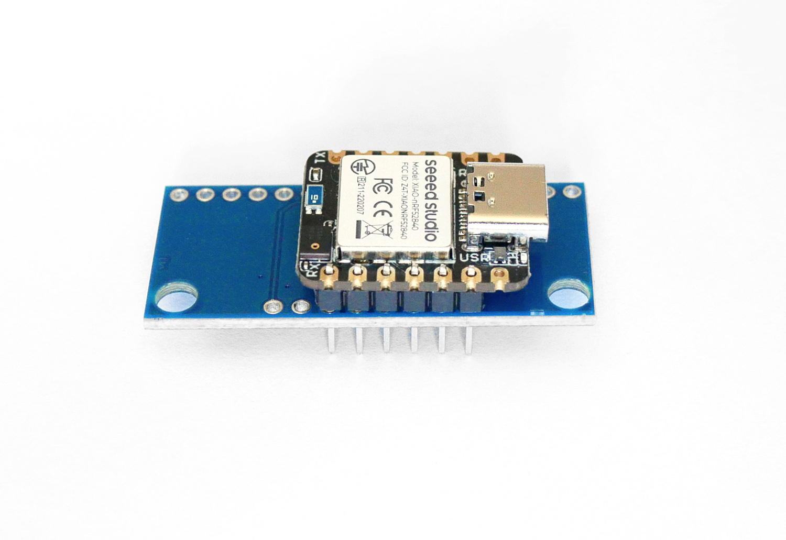

### 02 · Glove prep
Preparing the glove for wiring routing and battery placement (not actual used LiPo).

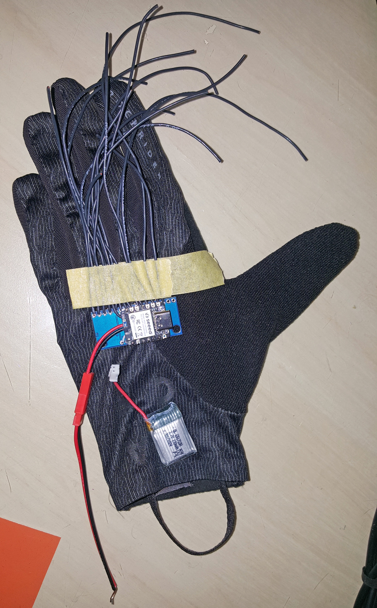

### 03 · Flex sensor + FSR
Sewing the index-finger flex sensor and the thumb FSR.

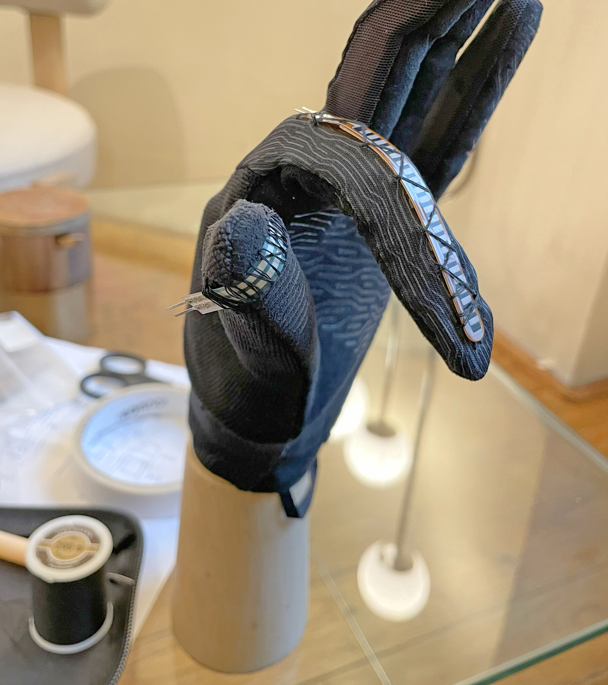

### 04 · Wiring — finger pads
Beginning the pad and sensor wire routing. 

- Oct up & down: 4067 channel 0 & 1
- Index modal: 4067 channel 2
- Pinky palm: 4067 channel 15

Note: I had originally planned the lowest note to be the base of the index and wired it as follows:

| Finger | Note #s from base to tip | 4067 channels |
|--------|--------------------------|---------------| 
| Index  |  1, 2, 3                 | 3, 4, 5       |
| Middle |  4, 5, 6                 | 6, 7, 8       |
| Ring   | 7, 8, 9                  | 9, 10, 11     |
| Pinky  | 10, 11 12                | 12, 13, 14    |
 

**However** in the code, I ended up reversing the low-to-high note order so that the base of the pinky is the lowest note. 

This explains the unusual note-to-channel mapping:

| Finger | Note #s from base to tip | 4067 channels |
|--------|--------------------------|---------------| 
| Index  |  10, 11, 12              | 3, 4, 5       |
| Middle |  7, 8, 9                 | 6, 7, 8       |
| Ring   | 4, 5, 6                  | 9, 10, 11     |
| Pinky  | 1, 2, 3                  | 12, 13, 14    |

So the 4067 channel scan order of notes 1-12 is 12,13,14,9,10,11,6,7,8,3,4,5

- The boost voltage regulator board was installed under the LED strip. 
- The +/- outputs of the boost regulator were soldered to wire poked up through the strip.
- The input end of the boost regulator is soldered directly to the +/- battery terminals on the Seeed XIAO

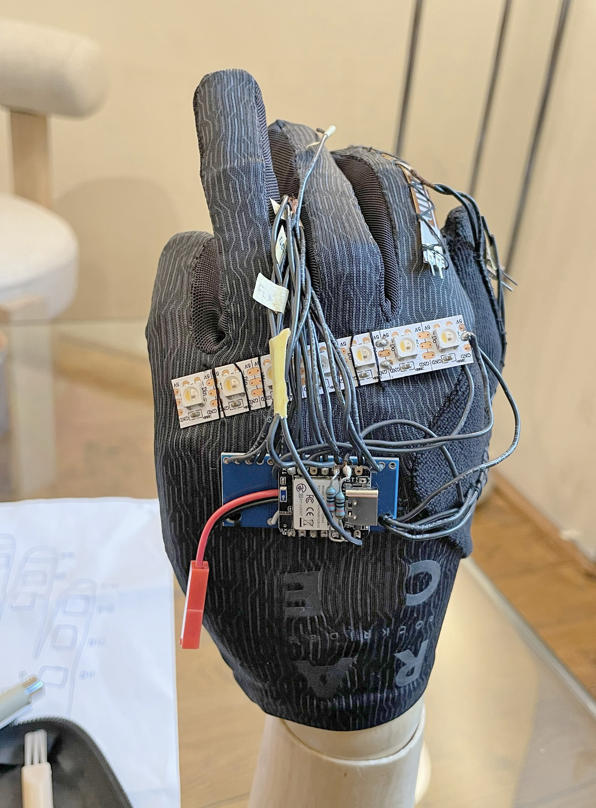

### 05 · XIAO Sense wiring
The pull-down resistors from A1 & A2 to ground on the XIAO Sense.

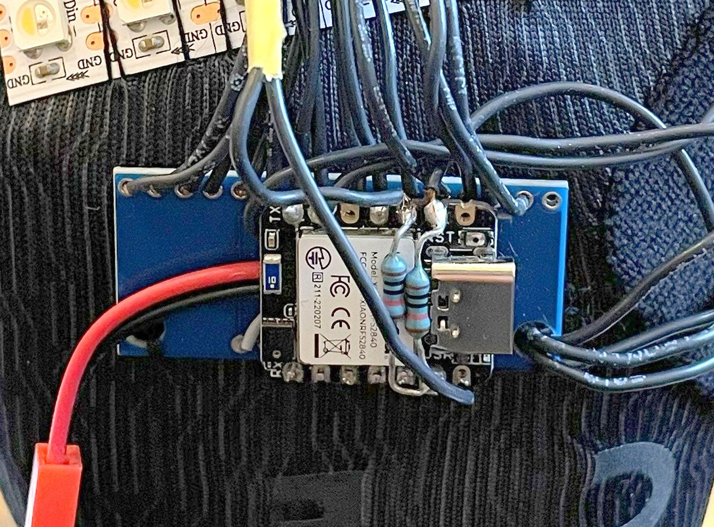

### 06 · Contact pads
Double-sided tape is mounted where the conductive contact pads will go. 
Bare wire strands are splayed over the tape and the conductive fabric is sewn overtop 

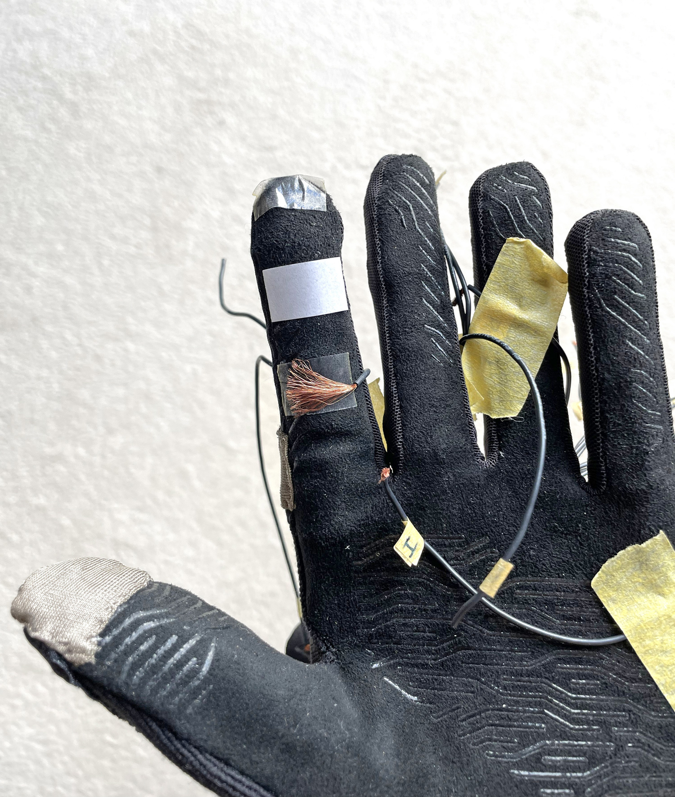

### 07 · Wiring — routing
Continuing the harness routing. Sewed lycra fabric over battery compartment and beginning to sew over the wires.

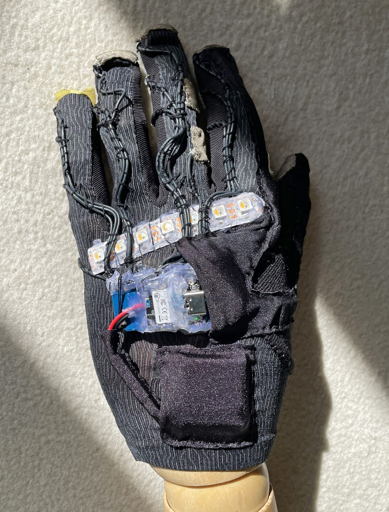

### 08 · Hot glue mess
Slathering hot glue on the wire solder joints and sealing much of the Seeed XIAO and LED strip. 
A sealed waterproof LED strip would have been better.   

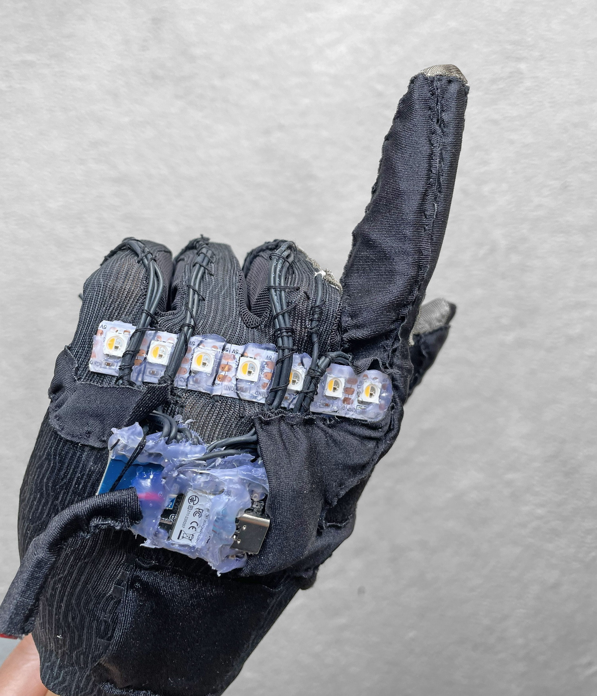

### 09 · Wiring — dress and tidy
Dressing the harness and tidying the runs.

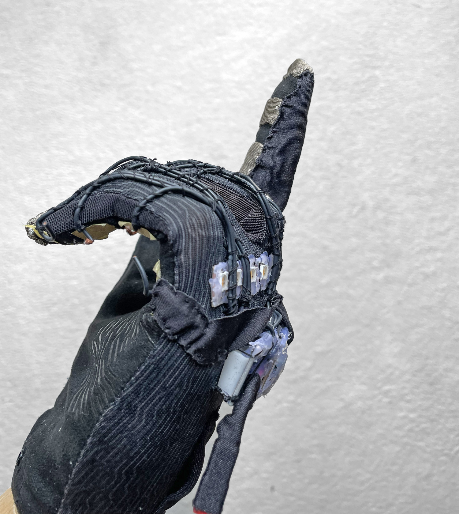

### 10 · Wiring cover
Sewing more lycra to cover and protect the wiring.

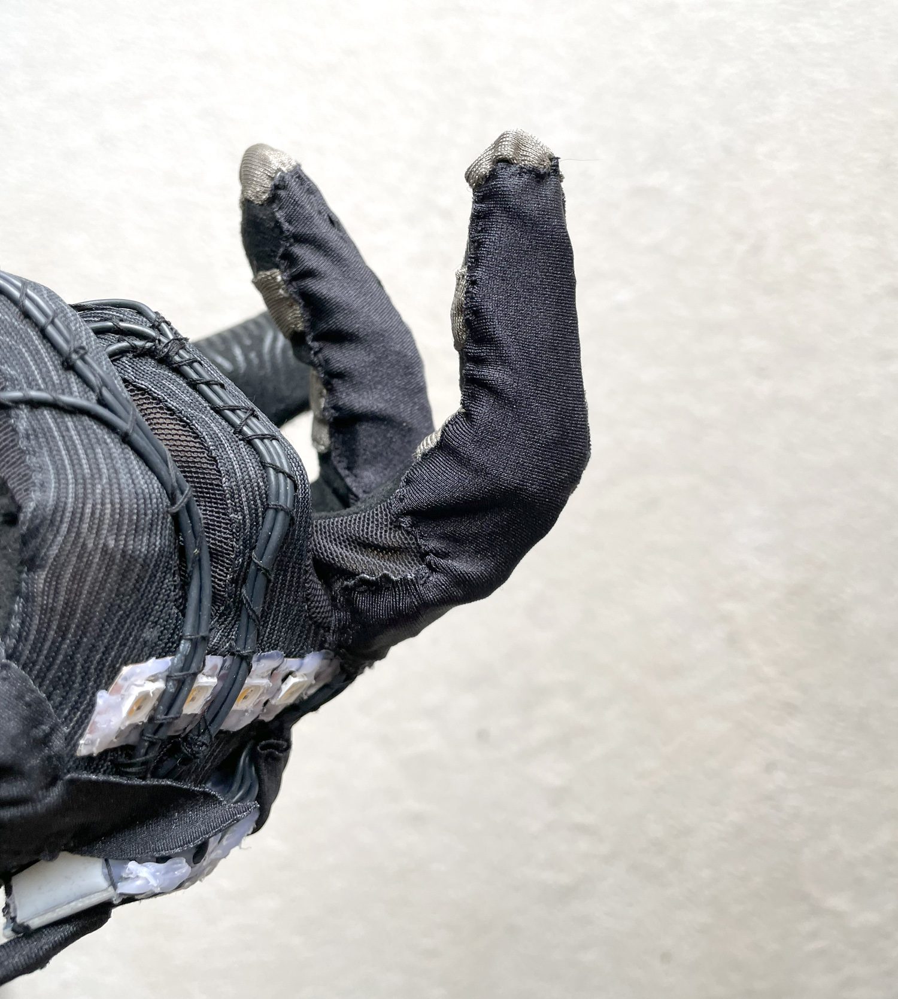

### 11 · Mesh over LED strip
Fitting a piece of pantyhose over the SK6812 LED strip as a mesh layer. 

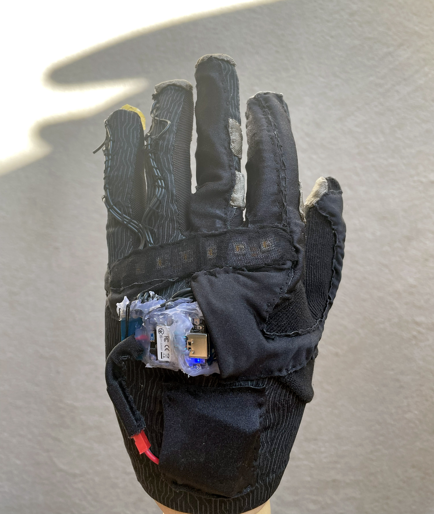

### 12 · Final coverings
Almost finished wiring covers.

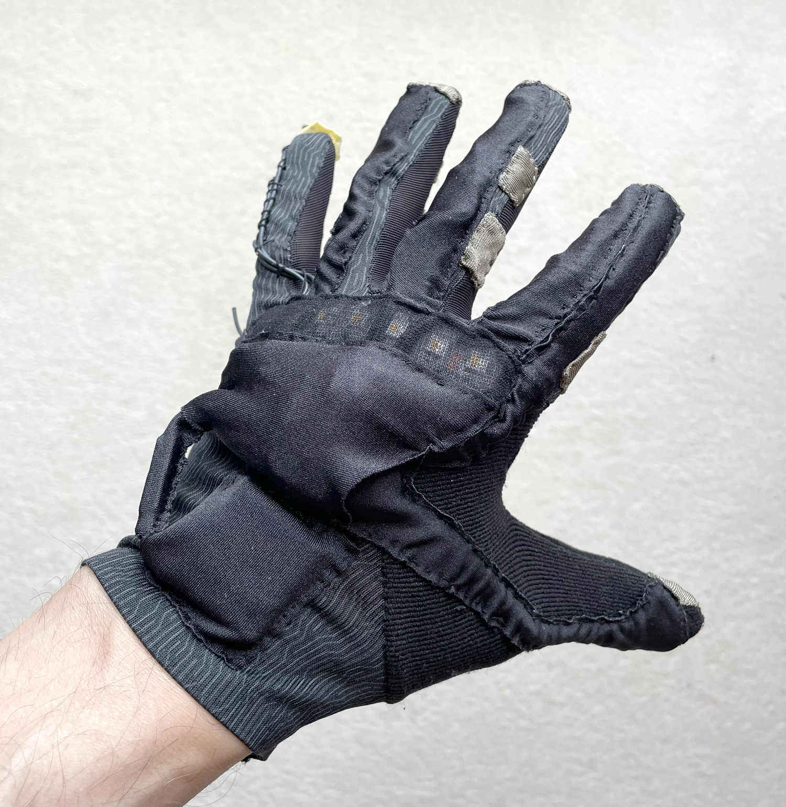

### 13 · Finished: Front

### 14 · Finished: Back

### 15 · Finished: Front bending

### 16 · Finished: Back bending

### 17 · Finished: Side

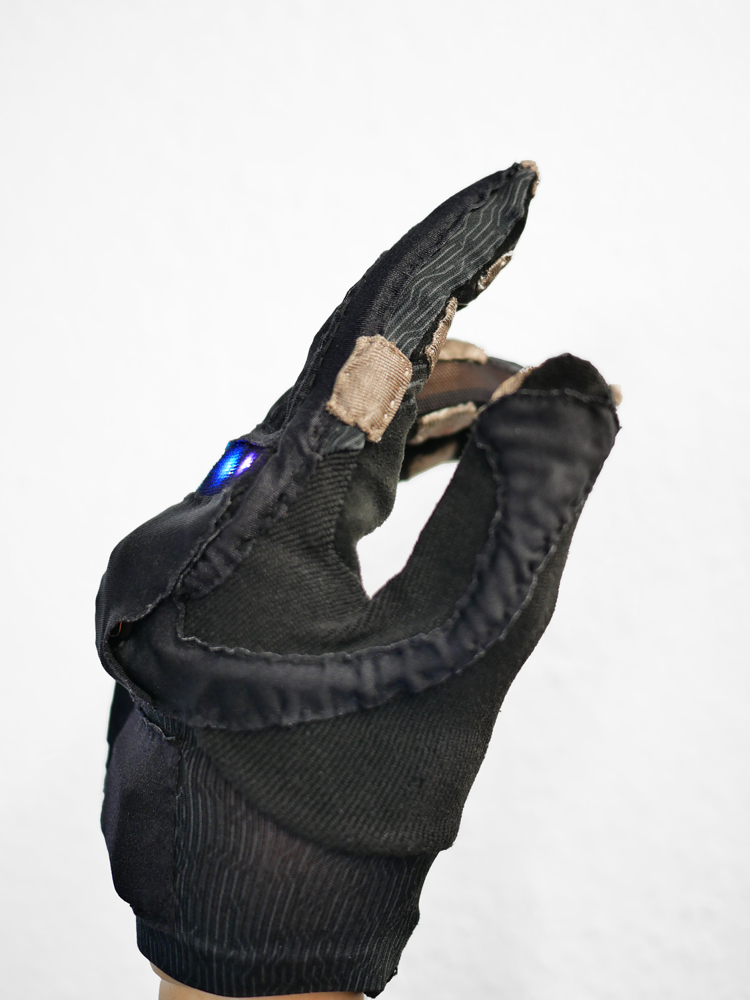

