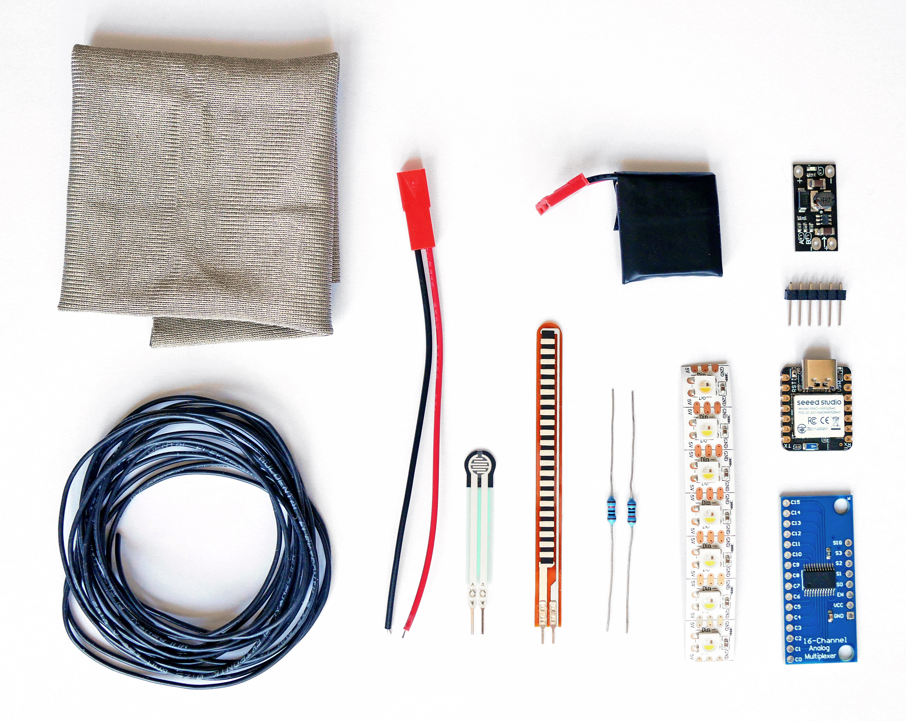
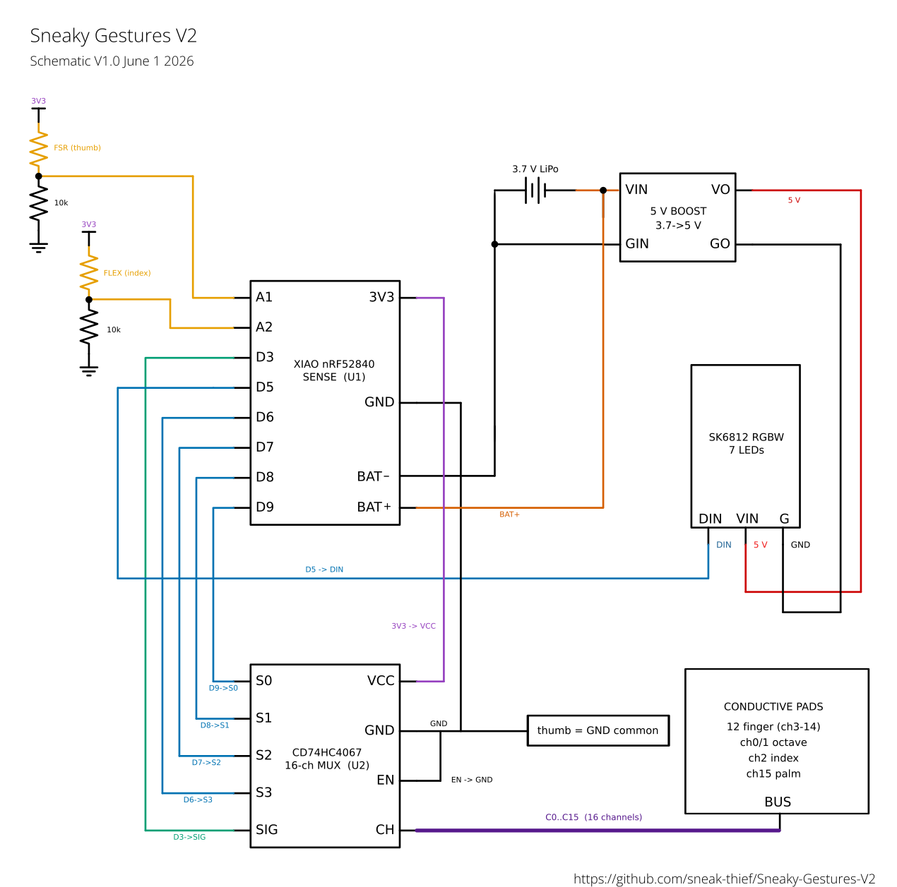

## Bill of Materials

| Component | Qty | Notes |
|-----------|:---:|-------|
| Seeed XIAO nRF52840 Sense | 1 | MCU · BLE-MIDI · onboard LSM6DS3 IMU |
| SK6812 RGBW LED | 7 | Addressable strip (NEO_GRBW), mounted on back of hand |
| CD74HC4067 breakout PCB | 1 | 16-channel analog multiplexer |
| FSR 0.3" | 1 | Force-sensitive resistor (thumb / aftertouch) |
| Flex sensor 3" / 78 mm | 1 | Index finger bend |
| LiPo battery, 3.7 V 400 mAh | 1 | 602626 or 602525 |
| 5 V boost regulator | 1 | Small PCB format (powers the LED strip) |
| Adafruit 1167   | 1 | Knit Conductive Fabric with silver |
| Cycling glove | 1 | Choose something tight fighting, breathable and comfortable |
| Silicone wire | 2m | 0.25mm2 with silicone insulation |
| lycra fabric | 1/4m2 | Stretchy and thin lycra for covering wires |

## Schematics

| File | Description |
|------|-------------|
| [`Sneaky-Gestures-V2-Schematic_V1.0.png`](Sneaky-Gestures-V2-Schematic_V1.0.png) | Schematics V1 (PNG) |
| [`Sneaky-Gestures-V2-Schematic_V1.0.pdf`](Sneaky-Gestures-V2-Schematic_V1.0.pdf) | Schematics V1 (PDF) |

